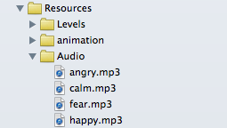

Audio in Cocos2d 3.0 is very simple. We'll give you a quick intro of anything you need to know about the new Sound API *OALSimpleAudio*.

# Playing a sound effect in Cocos2d 3.0

First of all, add the sound file(s) to your Xcode project:

The most important supported file format is *.mp3* but in general *OALSimpleAudio* supports all formats that are supported by iOS.

Now you are ready to play the sound:

    // access audio object
    OALSimpleAudio *audio = [OALSimpleAudio sharedInstance];
    // play sound effect
    [audio playEffect:@"your_file_name"];

If you want to loop the sound, there's another option for that:

    // access audio object
    OALSimpleAudio *audio = [OALSimpleAudio sharedInstance];
    // play sound effect in a loop
    [audio playEffect:@"your_file_name" loop:YES];

# Playing background music in Cocos2d 3.0

*OALSimpleAudio* uses a special resource saving way to play background sounds, *but you can only play one background sound at a time.* So if you have exactly one background sound you want to repeat, you might want to use this method:

    // access audio object
    OALSimpleAudio *audio = [OALSimpleAudio sharedInstance];
    // play background sound
    [audio playBg:@"your_file_name" loop:YES];

# Preloading sound in Cocos2d 3.0

If you have sound effects that are triggered by certain gameplay events, for example a collision between two objects, you will realize that your game will freeze for a fraction of a second when the effect is played for the first time. This happens because *OALSimpleAudio* needs to load your sound effect before it can play it and this loading process uses a lot of computing power.

You can solve this problem by preloading the sound effects you will use in your gameplay:

    // access audio object
    OALSimpleAudio *audio = [OALSimpleAudio sharedInstance];
    // play background sound
    [audio preloadEffect:@"your_file_name"];

Simply place the code above somewhere before you enter the actual gameplay, e.g. on your Startscreen.

This is all you need to get started with sounds in Cocos2d 3.0!

Happy Coding!

benji@makeschool.com
